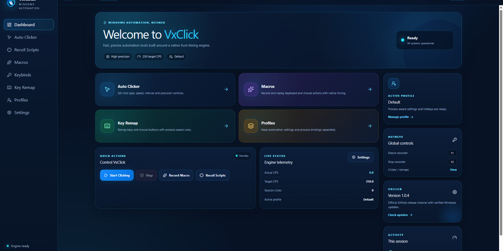

<h1 align="center">VxClick — Windows Auto Clicker & Input Automation</h1>

<p align="center">
  Fast, open-source Windows auto clicker, macro recorder, keyboard/mouse automation and remapping powered by a high-precision Rust core.
</p>

<p align="center">
  <a href="https://github.com/Vxiey/VxClick/releases/latest"></a>
  <a href="https://github.com/Vxiey/VxClick/actions/workflows/ci.yml"></a>
  
  
  
  
  
</p>

<p align="center">
  <a href="https://github.com/Vxiey/VxClick/releases/latest"><strong>Download VxClick</strong></a>
  · <a href="docs/getting-started.md">Getting started</a>
  · <a href="docs/README.md">Documentation</a>
  · <a href="https://github.com/Vxiey/VxClick/wiki">Wiki</a>
</p>

<p align="center">
  
</p>

VxClick is a **free, open-source Windows auto clicker and input automation desktop app** for precise CPS control, keyboard and mouse macros, global hotkeys, key/mouse remapping and advanced timing profiles. Its native Rust core uses Windows high-resolution timing and `SendInput` to prioritize stable timing, low input latency, low overhead and safe start/stop behavior.

Unlike a basic autoclicker built around a simple `sleep()` loop, VxClick uses absolute deadlines, drift correction, oversleep compensation and hybrid sleep/yield/spin waiting. The desktop application is built with Tauri 2 + React 19 while timing-critical automation stays in native Rust.

> **Current stable release:** v1.0.2. The release path includes native profile-aware hotkeys, persistent Macro Studio recording/playback, runtime key/mouse remapping, sandboxed Lua automation, randomization/burst/position modes, diagnostics, updater support and Windows release bundles.

## Windows auto clicker & automation features

- QPC (`QueryPerformanceCounter`) monotonic high-resolution clock.
- Absolute scheduling deadlines to avoid cumulative interval drift.
- Hybrid sleep / yield / spin waiting instead of a simple `sleep()` click loop.
- Native Windows `SendInput` for mouse and keyboard output.
- Left, right, middle, X1 and X2 mouse button support.
- Measured CPS, interval, jitter and missed-deadline benchmark telemetry.
- Low-level Windows keyboard/mouse hooks and profile-aware global hotkeys.
- Versioned local profiles with foreground-process auto switching.
- Stateful key/mouse/chord remapping with process scopes and consume/pass-through behavior.
- Native global macro recording and QPC macro playback with cancellation and 0.1x–10x speed scaling.
- Central held-input tracking and best-effort emergency release.
- Sandboxed Lua compiler/runtime wired into the desktop workflow.
- Randomized intervals, burst clicking, fixed-position and multi-point targeting.
- Tauri 2 + React 19 desktop UI.
- Local diagnostics, crash/performance logs and hardened GitHub update checking.
- Injected-event tagging to prevent self-triggering automation loops.

## Current feature status

| Area | Status | Notes |
| --- | --- | --- |
| Precision auto clicker | ✅ Working | Native Rust scheduler + `SendInput`, 1–20,000 CPS safety range |
| Mouse buttons | ✅ Working | Left, right, middle, X1, X2 |
| Live CPS counter | ✅ Working | Desktop polls native engine state |
| Precision benchmark | ✅ Working | Desktop + CLI reporting actual CPS, interval/jitter percentiles and missed deadlines |
| Profiles | ✅ Working | Persistent JSON profiles + foreground-process auto switch |
| Global hooks / clicker hotkeys | ✅ Working | Native profile-aware toggle/hold/once + emergency stop |
| Diagnostics / logs | ✅ Working | Session, crash and performance logging |
| Update checker | ✅ Working | Official `Vxiey/VxClick` releases + SHA-256 patch verification/staging |
| Macro playback core | ✅ Working | QPC absolute-deadline player with cancellation and held-input cleanup |
| Macro Studio | ✅ Working | Persistent save/load/delete, native global recording, playback and macro hotkeys |
| Key remapping | ✅ Working | Native hook execution, key/mouse/chord mappings, process scopes and pass-through control |
| Lua automation | ✅ Working | Sandboxed Lua validate/run/stop flow compiled into native macro events |
| Randomization / burst / position modes | ✅ Working | UI controls are passed to and executed by the native Rust clicker |

Full details: **[docs/features.md](docs/features.md)**.

## Quick start

### Requirements

- Windows 10/11 x64
- Microsoft Edge WebView2 Runtime

### Download VxClick for Windows

Download the latest portable `VxClick.exe`, Windows setup executable or MSI package from **[GitHub Releases](https://github.com/Vxiey/VxClick/releases/latest)**.

### Build from source

```powershell
git clone https://github.com/Vxiey/VxClick.git
cd VxClick
npm install
npm run tauri:build
```

For development:

```powershell
npm run tauri:dev
```

### Native core only

```powershell
cargo build --release
cargo test
```

Run a precision benchmark:

```powershell
cargo run --release -- benchmark --cps 500 --seconds 10 --button left
cargo run --release -- benchmark --cps 2000 --seconds 5 --button left
```

The benchmark reports measured output rather than assuming requested CPS equals delivered CPS.

## Documentation

Project documentation is versioned with the code under [`docs/`](docs/README.md) and synchronized to the GitHub Wiki:

- [Documentation home](docs/README.md)
- [Getting started](docs/getting-started.md)
- [Feature status](docs/features.md)
- [Architecture](docs/architecture.md)
- [Timing engine](docs/timing-engine.md)
- [Macros, hotkeys, remapping & Lua](docs/automation-systems.md)
- [VxClick 1.0 Wiki pages](docs/wiki/Home.md)
- [Development guide](docs/development.md)
- [Diagnostics](docs/diagnostics.md)
- [Regression checklist](docs/regression-checklist.md)
- [Changelog](CHANGELOG.md)

## Architecture at a glance

```text
React UI (ui/)
        │
        ▼
Tauri desktop bridge (src-tauri/)
        │
        ├── profiles / diagnostics / updater / benchmark
        │
        ├── native hotkey / macro / remap runtime
        │
        ▼
Rust automation core (src/)
        │
        ├── precision scheduler + telemetry
        ├── macro player / remap / hotkey models
        ├── Lua runtime
        │
        ▼
Windows platform layer
        ├── QueryPerformanceCounter
        ├── SendInput
        ├── low-level keyboard/mouse hooks
        └── held-input safety release
```

The timing worker is intentionally kept separate from UI rendering and frontend polling.

## Timing design

For a target rate `CPS`, VxClick derives an interval from the QPC clock frequency and advances an **absolute deadline** after each click. It does not schedule the next click relative to when the previous click happened.

For long waits the engine sleeps briefly, then yields as the deadline approaches, and only spins inside a small final timing window. If Windows stalls the worker for several intervals, the live clicker re-anchors the schedule instead of emitting a large catch-up burst.

Read the implementation notes in **[docs/timing-engine.md](docs/timing-engine.md)**.

## Safety and responsible use

> **Use at your own risk.** The developer does not accept responsibility for account penalties, bans, suspensions, data loss, or other consequences resulting from automation, macros, Lua scripts or recoil-style automation. You are responsible for complying with the rules and terms of service of every application or game you automate.

VxClick does **not** include anti-detection, anti-cheat bypass, process injection or stealth functionality.

The emergency-stop path performs a best-effort release of synthetic keys and mouse buttons still tracked as held by VxClick. Raw typed text and Macro Recorder streams are not written to diagnostic logs by default.

## Contributing

Before changing timing or input hot paths, measure the current behavior and keep the smallest robust change. New features should not compromise stop latency, timing stability or input cleanup.

See **[docs/development.md](docs/development.md)** before opening a pull request.

## License

MIT — see [LICENSE](LICENSE).
